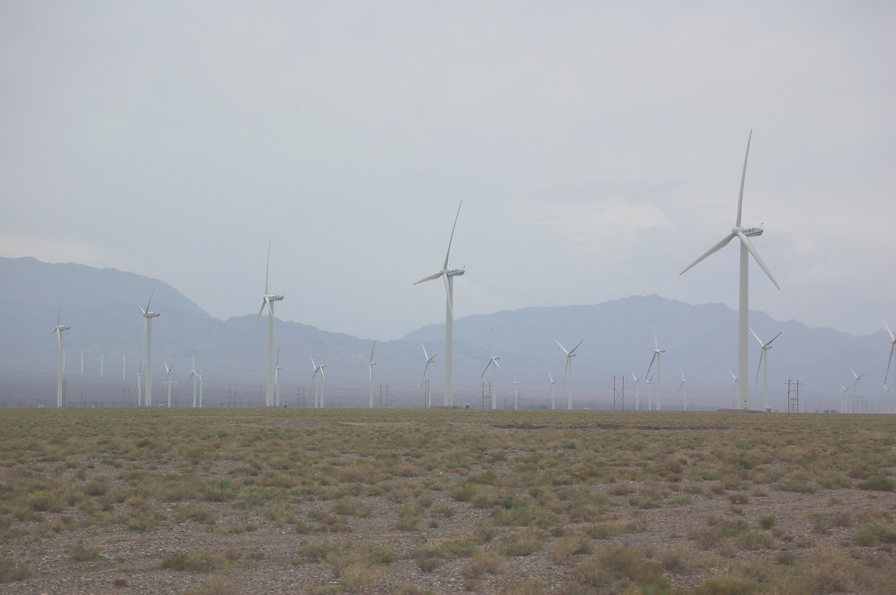
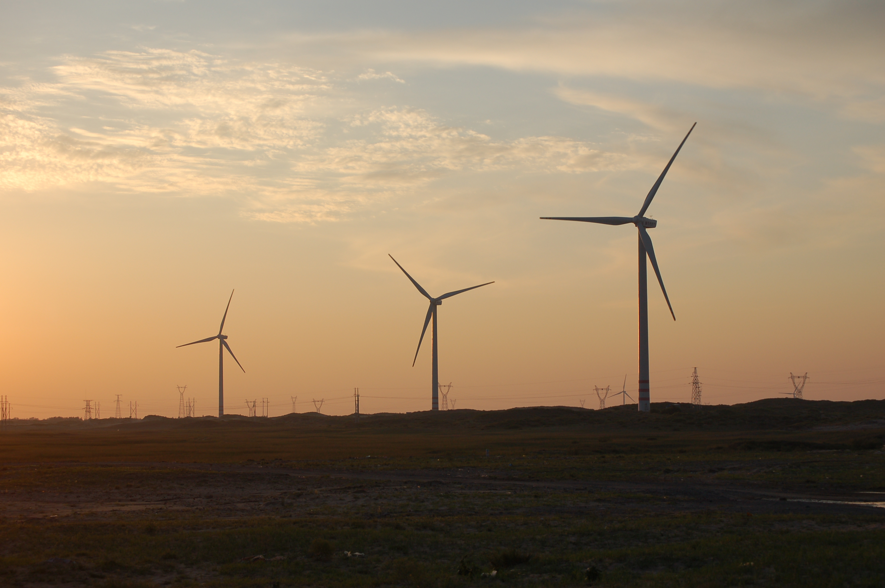
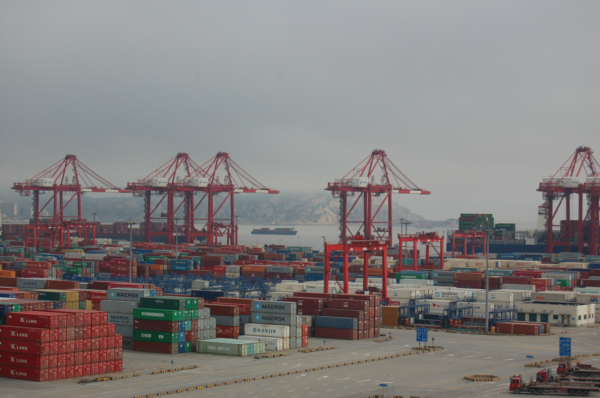

## Renewable energy resource planning

Reaching high penetrations (>50%) of intermittent renewable energy requires careful assessment of resource quality, land use, supporting infrastructure, and power system reliability. Our work combines high-resolution weather data and geospatial layers to rank infrastructure siting decisions, and develops novel algorithmic combinations with capacity expansion planning optimizations.

### Key Questions
- Where should we prioritize and what are the localized impacts of rapid renewable energy build-out?
- What are land use constraints of low-carbon energy and appropriate technological pathways to address them?

## Affordable and reliable low-carbon power market models

Grid integration of renewable energy depends on the structure of operations and markets, which vary in terms of effectiveness in managing variability and uncertainty. Our work examines real-world dispatch and scheduling institutions in both advanced and emerging power markets in order to develop affordable and reliable solutions to low-carbon energy development.

### Key Questions
- What are the efficiencies and emissions of non-standard power market designs?
- How much, where, and for what compensation is firm capacity needed to operate the system reliably?

## Political economy of industrial policy and low-carbon transitions in firms

Climate goals are increasingly being furthered by a range of policy tools, including industrial policy designed to stimulate localization of manufacturing. These policies must balance key trade-offs in maintaining political support while taking advantage of globalization-induced economies of scale. At the center of these efforts is the role of the firm and its decisions to embrace (or not) a low-carbon transition. With state-owned enterprises dominant in many countries’ energy sectors, typical models of firm behavior may be insufficient.

### Key Questions
- What are the most effective policies for achieving both climate and domestic industrial development goals?
- What incentives are necessary to encourage firm low-carbon transitions and how should they be designed in contexts with high levels of state ownership?

